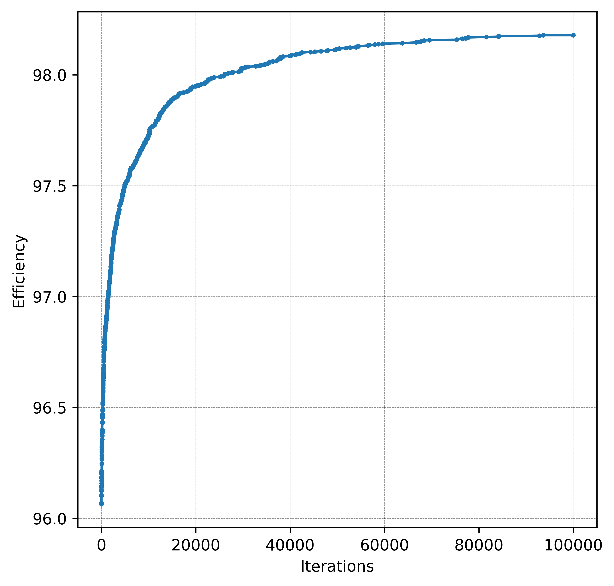
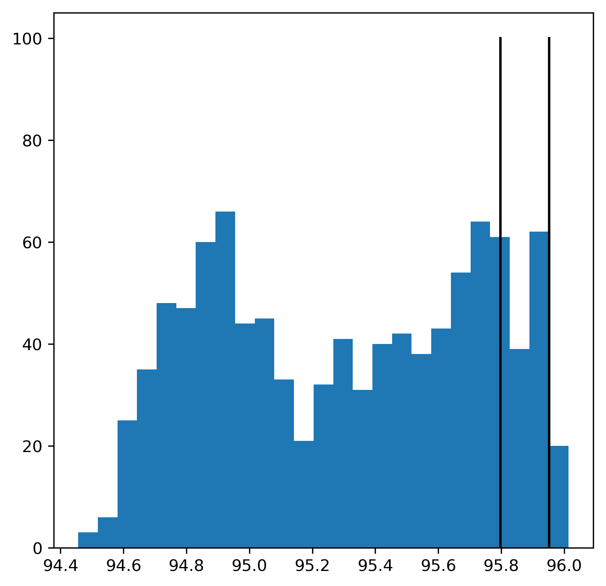
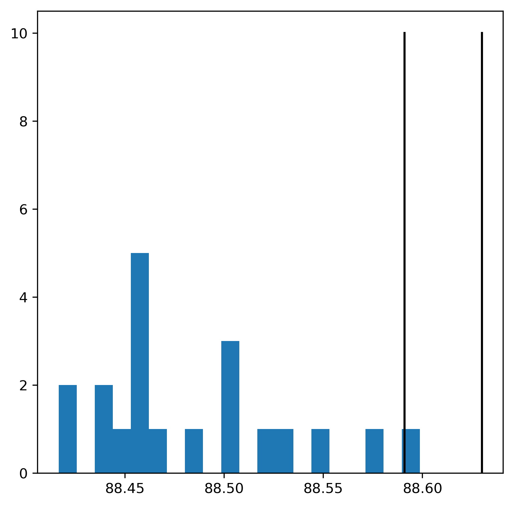
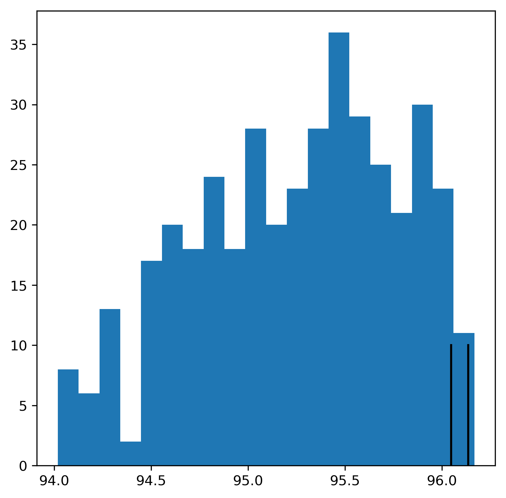
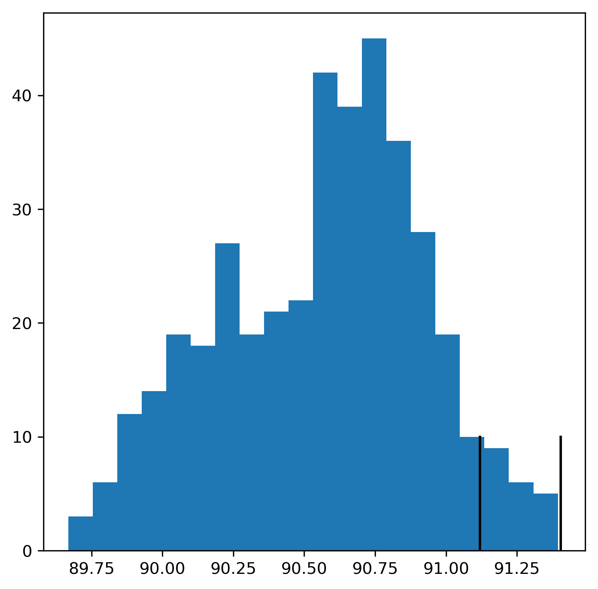

# Test of the mutations procedure

### Medium problem size (250x200):
1. Tests show an increase in efficiency from 95.90% to 96.70% in 1000 iterations.  
2. Further tests show an increase from 96.06% to 98.18% in 100,000 iterations.
During the iterations, the efficiency converges to a local maximum, a chance of random mutation to increase the score drops dramatically.  
Consider using two-step mutation, removing two layers of adjacent slices.  

### Big problem size (1000x1000):
In the case of __big__ input, the growth of efficiency is a lot smaller and the calcualtions are slower.

# Test of the recombination procedure
### Initial filling scheme: l->r, u->d
For both __medium__ and __big__ problem size, recombination on average shows a huge dropdown of efficiency in child individuals compared to the parents.  

|    |  |
| :---: | :---: |
| medium-size problem | big-size problem |

### Random filling schemes: 
[(l->r, u->d), (u->d, l->r), (r->l, d->u), (d->u, r->l)]  
Due to the pattern of filling, the first two schemes are more efficient, resulting in average efficiency of 95% for medium problem size. 
It the case of two latter schemes, an average efficiency is around 91%.

However, recombination for both of them still works inefficiently.

|    |  |
| :---: | :---: |
| recombination of two former scheme parents | recombination of two latter scheme parents |

