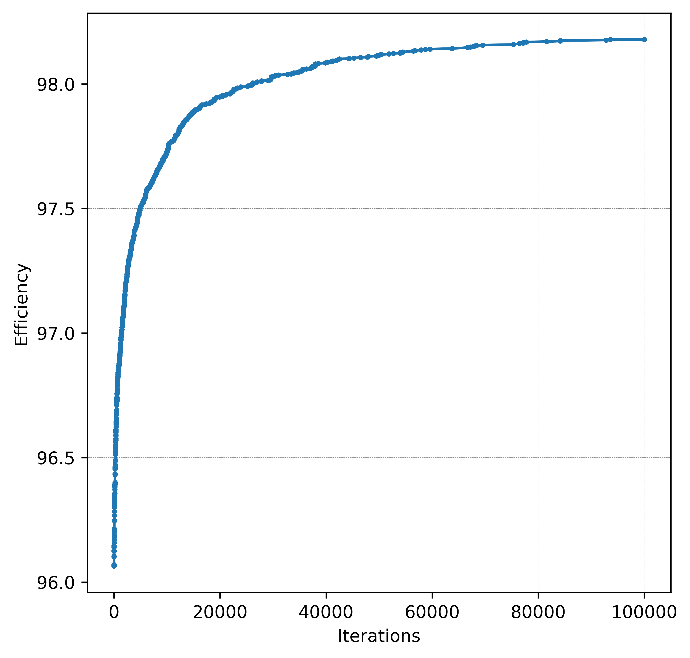
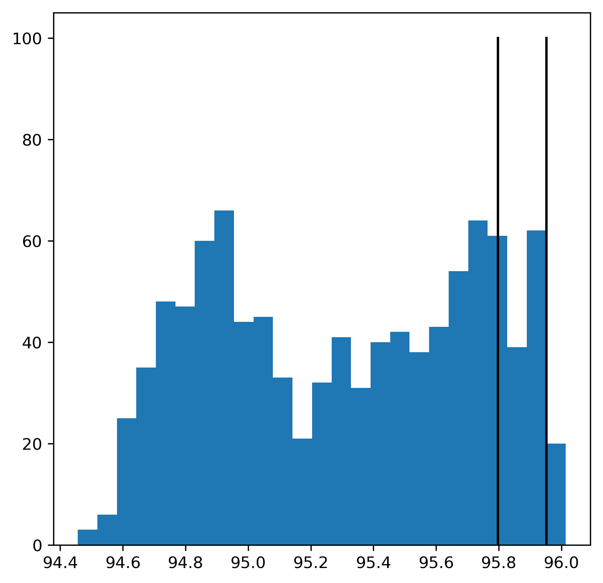
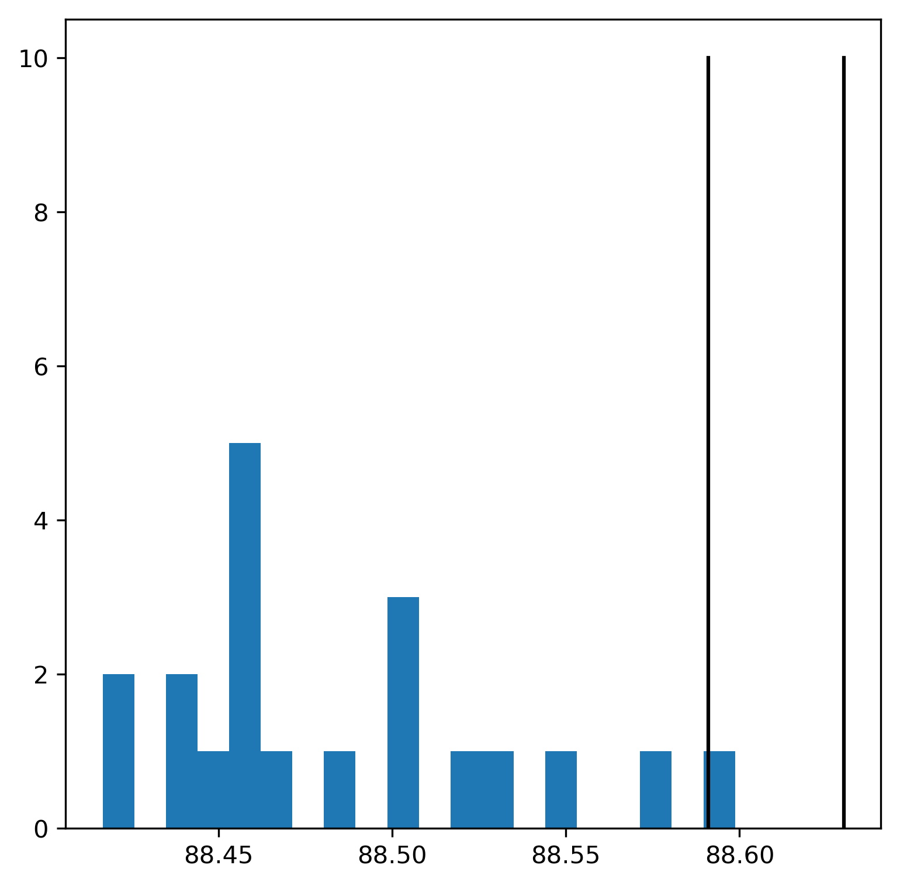

# Test of the mutations procedure

### Medium problem size (250x200):
1. Tests show an increase in efficiency from 95.90% to 96.70% in 1000 iterations.  
2. Further tests show an increase from 96.06% to 98.18% in 100,000 iterations.
During the iterations, the efficiency converges to a local maximum, a chance of random mutation to increase the score drops dramatically.  
Consider using two-step mutation, removing two layers of adjacent slices.

### Big problem size (1000x1000):
In the case of __big__ input, the growth of efficiency is a lot smaller and the calcualtions are slower.

# Test of the recombination procedure
For both __medium__ and __big__ problem size, recombination on average shows a huge dropdown of efficiency in child individuals compared to the parents. 

